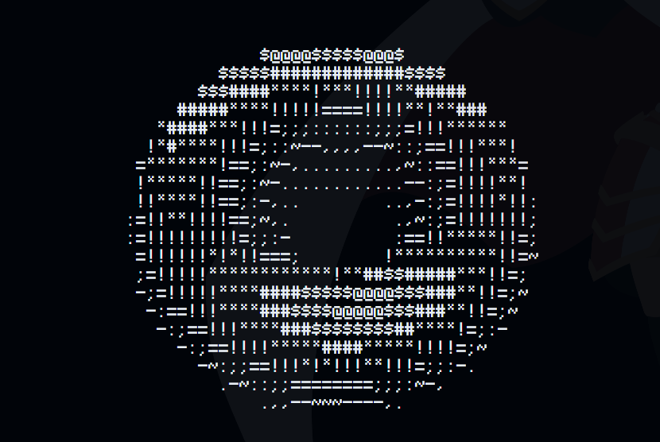

# Donut.cpp

Based on the idea from a video by GreenCode.

```cpp
// Run the code like normal C++ files
```

This repository includes four 3D simulations in the terminal:

- **Donut** (Original code from the creator)
- **Donut_Improved** (My improved version)
- **Cube** (My code)
- **Pyramid** (My code, but this one is hollow)




https://www.a1k0n.net/2011/07/20/donut-math.html

Run the code and see it for yourself.