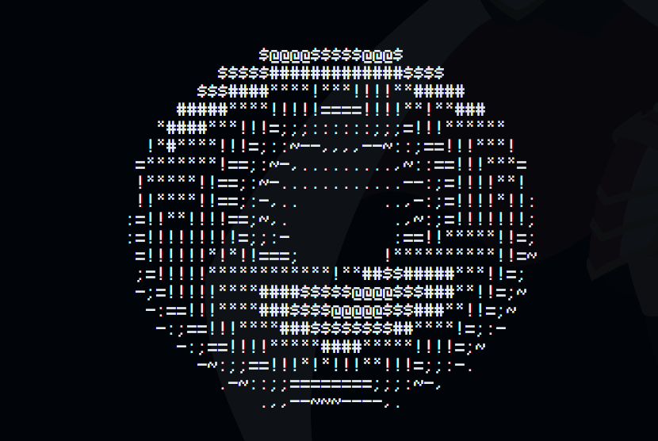

# 🍩 Donut.cpp

A modern C++ take on the classic ASCII donut, inspired by [GreenCode's video](https://www.youtube.com/watch?v=74FJ8TTMM5E) and [a1k0n's original C code](https://www.a1k0n.net/2011/07/20/donut-math.html). Enhanced with new shapes and customization options.

## Quick Start

Run `run.bat` to compile and launch the interactive menu.

## Available Shapes

| File                | Description                    |
|---------------------|--------------------------------|
| `donut.cpp`         | Classic spinning ASCII donut   |
| `donut_improved.cpp`| Donut with color & scaling     |
| `cube.cpp`          | Spinning shaded ASCII cube     |
| `pyramid.cpp`       | Wireframe spinning pyramid     |

---